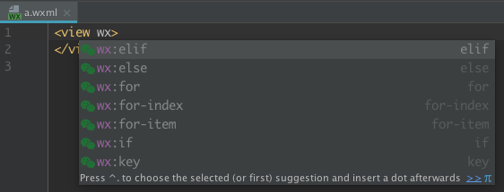

# wxapp Plugin

## 关于代码格式化
首先……个人建议
对于微信小程序，请多一层目录拿来搞配置文件……因为微信的谜之编译喜欢把他自己的整个目录搞上去……
（为什么这么做在下面有说明，因为大家写代码肯定需要智能提示各种函数吧……）

具体例子见 [wildfire-wxapp](https://github.com/zxj5470/wildfire-wxapp)

当然了大家也可以不这么做，等什么时候我把 external library 和 代码 format 格式做出来就不需要这个亚子了……

## 额外的配置
### 代码缩进 
另外请安装 editorconfig 插件（2018及以后的 IDEA-U 是内置了，但是 PhpStorm 和 WebStorm 我不确定有没有内置）

这个是用来保证代码缩进 2 个空格的。

配置见 [.editorconfig](https://github.com/zxj5470/wildfire-wxapp/blob/master/.editorconfig)

### 代码智能提示
首先确保了你的目录结构是那样的……然后有一个 wx.d.ts 文件……
在 [Typescript-wxApi.d.ts](https://github.com/Adherentman/Typescript-wxApi.d.ts) 这个仓库中。
[直接下载](https://github.com/Adherentman/Typescript-wxApi.d.ts/raw/master/wx.d.ts)

然后这个亚子：

好了，那没事了

## 功能
### 跳转
- js
	- 上面【那没事了】那张图，点击 url 的字符串可跳转到对于 .js
- wxml
	- `{{ identifier }}`中的跳转到变量
	- `bind***="函数名"` 跳转到对应函数
	- `class='cls'` 跳转到 `当前.wxss` 或 `app.wxss`
	
## Pending……

## ScreenShots

### WXSS

### WXML

#### Keywords for `wx:`

